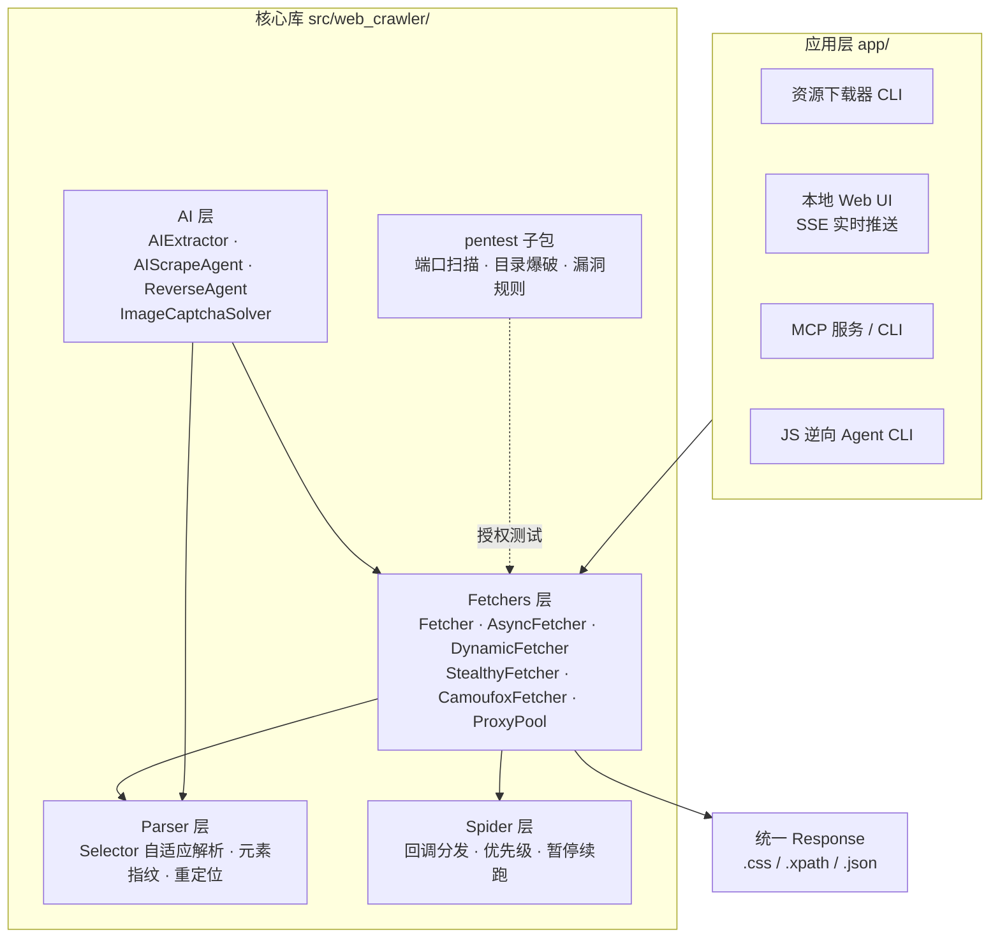

# web-crawler

<p align="center">
  
  
  
  
  
  
  
</p>

Scrapling 风格的隐身网页爬虫库：**自适应选择器**、**TLS 指纹隐身 HTTP**、**JS 渲染**与**回调式 Spider 框架**，另附一套应用层资源下载器与本地 Web UI。适用于需要稳定、低反爬风险的网页数据采集、动态页面渲染与加密参数逆向分析的开发者。

## 分层架构



## 功能特性

- **自适应解析器** — `Selector` 基于 `lxml`，支持元素指纹计算与结构相似度重定位：站点改版导致选择器失效时，已保存的指纹会自动在新页面中重新找到对应元素（Scrapling 的标志性能力）。公开 `save` / `retrieve` / `relocate` API 便于显式管理指纹；内置 `find_by_regex`、`re` / `re_first`、`get_all_text`、`prettify`、完整 DOM 遍历（`parent` / `children` / `siblings` / `next` / `previous` / `path`），以及 `ResultList` 批量辅助方法（`css` / `xpath` / `get` / `getall` / `.first` / `.last`）。支持 Scrapling 风格 `::attr(name)` 伪元素直接取属性。
- **隐身 HTTP** — `Fetcher` 通过 `curl_cffi` 重放真实浏览器的 TLS/JA3 指纹与 HTTP/2 帧序，使请求在网络层与 Chrome 难以区分；支持 `impersonate="chrome131"` 等浏览器预设，并可通过 `ja3_fingerprint` 参数透传到 `curl_cffi` 的 `ja3` 参数做细粒度 TLS 扩展定制（`max_redirects` 默认 5，限制重定向跳数）。`curl_cffi` 缺失时自动降级到 `httpx`（带警告）。`AsyncFetcher` 提供纯异步 API。
- **懒加载** — `import web_crawler` 不会强制加载 `playwright` / `curl_cffi`，重型子模块在首次访问时才解析（Scrapling 同款模式），仅需解析功能的用户无需安装浏览器依赖。
- **JS 渲染** — `DynamicFetcher` 驱动 Playwright/Chromium 渲染动态页面，支持按资源类型屏蔽、按选择器等待。
- **反爬处理** — `StealthyFetcher` 注入指纹补丁 JS、人类化鼠标/滚动轨迹，并对 Cloudflare 挑战做尽力而为的处理。
- **代理轮换** — `ProxyPool` 支持轮询/随机策略与按代理失败次数冷却。
- **Spider 框架** — `Spider` / `Request` 提供回调分发、优先级调度、域名过滤、指纹去重（method+url+body，`DupeFilter` 可插拔）、失败重试（指数退避）、可选 `robots.txt` 遵守与基于 JSON 的暂停/续跑。
- **统一 `Response`** — 所有 fetcher 返回同一 `Response` 对象，内置 `.css()` / `.xpath()` / `.json()` / `urljoin()` 辅助方法。
- **AI 辅助抓取** — `AIExtractor` 把自然语言字段描述转换为校验过的 CSS 选择器（含自愈能力）；`AIScrapeAgent` 编排抓取与抽取，遵守 `robots.txt`，对 429/503 退避（遵循 `Retry-After`），遇到卡死会返回"转人工处理"。
- **JS 逆向 Agent** — `ReverseAgent` 通过 **观察 → 思考 → 行动** 循环（`CamoufoxFetcher` + DeepSeek-V4-Pro）逆向目标站点的加密逻辑：注入 JS Hook（fetch / XHR / cookie / `crypto.subtle` / webpack / console）、捕获网络流量、拆分 webpack 包，再让 LLM 反混淆并在 Python 中重实现签名算法。内置 6 种真实浏览器交互动作（`click` / `type` / `scroll` / `press` / `hover` / `select_option`）、3 种多标签动作（`new_tab` / `switch_tab` / `close_tab`）与人类化输入轨迹；危险点击护栏与选择器注入拦截。同时通过 MCP 服务（`web-crawler-mcp`）、命令行（`web-crawler-reverse`）与 Web UI（SSE 实时推送 `/reverse/stream`）暴露。
- **图片验证码识别** — `ImageCaptchaSolver` 无需浏览器即可识别三类图片挑战：文本 OCR（4–8 位字母数字）、滑块缺口定位（Pillow + numpy 模板匹配）、点选坐标识别（视觉 LLM）。后端按 `ddddocr` → numpy 模板匹配 → LLM Vision 依次降级。`CaptchaManager` 在 `enable_image_captcha=True`（默认）时自动注入图片求解器，端到端处理 hCaptcha / reCAPTCHA v2 图片挑战与 GeeTest 拼图。
- **轻量渗透辅助** — `web_crawler.pentest` 子包提供纯 Python、无外部命令依赖的侦察工具：`PortScanner`（TCP connect + TOP-100 端口）、`DirBruter`（60+ 常见路径）、`SubdomainEnumerator`（80+ 子域前缀字典）、`VulnScanner`（SQL 注入 / XSS / 路径穿越规则检测，可选 LLM 分析）、`HeaderChecker`（8 项安全头检测 + A–F 评级），由 `PentestReport` 聚合。**仅限已获授权的安全测试**。
- **生产级 Agent 能力** — `ReverseAgent` 对齐 browser-use / Skyvern 等主流 Agent 框架，内置 DOM 焦点裁剪（`DomPruner`，约 80% token 削减）、断点续跑（`CheckpointManager`）、动作置信度评分（`ConfidenceScorer`）、动作护栏（`ActionGuard`）、Planner/Actor 双脑分离（`Planner`）、循环检测与上下文压缩（`LoopDetector` / `ContextCompressor`）、独立任务裁决（`TaskJudge`）、成功路径录制（`RunRecorder`）、事件总线与崩溃自愈（`watchdog`）、Pydantic 结构化校验（`SchemaValidator`）。全部能力可经 `ReverseAgentConfig` 独立开关。

## 技术栈

- **语言**：Python 3.10+，全量类型标注（含 PEP 561 `py.typed`）
- **解析**：`lxml`、`cssselect`、`beautifulsoup4`
- **网络**：`httpx`（核心依赖）、`curl_cffi`（TLS 隐身，可选）、`playwright`（JS 渲染，可选）、`camoufox`（抗指纹 Firefox，可选）
- **AI / 逆向**：OpenAI 兼容 LLM 抽象层（默认 DeepSeek-V4-Pro，仅依赖 httpx）、`pydantic`（结构化校验，可选）、`pycryptodome`（AES 解密，可选）
- **验证码**：`ddddocr`、`numpy`、`Pillow`（可选）
- **存储**：SQLite（标准库 `sqlite3`，用于自适应指纹与任务记录）
- **Web UI**：标准库 `http.server`（`ThreadingHTTPServer`），SSE 实时推送
- **质量工具**：`pytest` / `pytest-asyncio` / `pytest-cov`、`ruff`、`mypy`
- **文档**：MkDocs + Material + mkdocstrings
- **CI**：GitHub Actions（`.github/workflows/ci.yml`）

## 快速开始

### 隐身 HTTP 抓取

```python
from web_crawler import Fetcher

with Fetcher(impersonate="chrome131", timeout=30.0) as f:
    resp = f.get("https://example.com")
    print(resp.status, resp.css_first("h1").text)
```

### 自适应解析（站点改版也能定位元素）

```python
from web_crawler import Selector, AdaptiveStorage

storage = AdaptiveStorage()  # 默认存于 ~/.web_crawler/adaptive.sqlite3

# 第一次运行：保存元素指纹
page = Selector(html_v1, url="https://shop.example.com", adaptive=True, storage=storage)
title = page.css_first("#product-title", auto_save=True)

# 站点改版、id 消失后……
page2 = Selector(html_v2, url="https://shop.example.com", adaptive=True, storage=storage)
relocated = page2.css_first("#product-title", adaptive=True)  # 按相似度自动重定位
```

### Spider 框架

```python
from web_crawler import Spider, Request, Fetcher


class QuotesSpider(Spider):
    start_urls = ["https://quotes.toscrape.com/"]
    allowed_domains = ["quotes.toscrape.com"]

    def parse(self, response):
        for quote in response.css("div.quote"):
            yield {"text": quote.css_first(".text").text, "author": quote.css_first(".author").text}
        nxt = response.css_first("li.next > a")
        if nxt:
            yield Request(response.urljoin(nxt.attr("href")))


items = QuotesSpider(fetcher=Fetcher(impersonate="chrome131")).run()
# 中途暂停、之后续跑：
# spider.run(state_file="state.json")
# QuotesSpider(fetcher=Fetcher()).run(state_file="state.json", resume=True)
```

Spider 还内置了爬虫框架级的通用机制，均可通过类属性开关：

```python
class RobustSpider(Spider):
    start_urls = ["https://example.com/"]
    max_retries = 2  # 下载失败指数退避重试（默认 0 不重试）
    per_domain_delay = {"example.com": 1.0}  # 同域最小请求间隔（秒），可配多域
    respect_robots = True  # 回调产出的请求先过 robots.txt（默认关闭）
    user_agent = "my-bot"  # robots.txt 检查使用的 UA
```

去重默认按 `method + url + body` 的 SHA1 指纹判定（同 URL 不同分页参数不再互相误杀），需要磁盘持久化等自定义行为时可传入 `dupefilter=MyDupeFilter()`。

`stream()` 为持续流式调度：并发槽位空出即派发下一个请求，慢请求不会阻塞后续调度。下载流程可通过 `DownloaderMiddleware` 介入（`process_request` 返回 `Response` 可短路下载、抛 `IgnoreRequest` 可丢弃请求；`process_response` 可变换响应），回调产出的 item 经 `ItemPipeline` 链变换/过滤（抛 `DropItem` 或返回 `None` 丢弃）：

```python
from web_crawler import DownloaderMiddleware, ItemPipeline, IgnoreRequest, DropItem


class CacheMiddleware(DownloaderMiddleware):
    def process_request(self, request, spider):
        cached = my_cache.get(request.url)
        return cached  # 命中缓存时短路下载；None 则正常放行


class CleanPipeline(ItemPipeline):
    def process_item(self, item, spider):
        if not item.get("name"):
            raise DropItem("empty name")
        return {**item, "name": item["name"].strip()}


class MySpider(Spider):
    middlewares = [CacheMiddleware]  # 类或实例均可，按声明顺序执行
    item_pipelines = [CleanPipeline]
```

### JS 渲染与反爬

```python
from web_crawler import DynamicFetcher, StealthyFetcher

# 渲染 JS 重页面
with DynamicFetcher(headless=True, wait_selector="div.content") as f:
    resp = f.fetch("https://spa.example.com")

# 隐身模式：人类化输入 + Cloudflare 感知
with StealthyFetcher(google_search=True, humanize=True) as f:
    resp = f.fetch("https://protected.example.com")
```

### 代理轮换

```python
from web_crawler import Fetcher, ProxyPool

pool = ProxyPool(
    ["http://u:p@proxy1:8080", "http://proxy2:3128"],
    strategy="round_robin",
    max_failures=3,
    cooldown=60,
)
with Fetcher(proxy=pool, impersonate="chrome131") as f:
    resp = f.get("https://example.com")
```

## 安装与运行

> 注意：PyPI 上名为 `web-crawler` 的包已被其他项目占用（与本项目无关）。直接 `pip install web-crawler` 会装到错误的包。请使用以下源码安装方式，或先为发行版更名后再发布。

```bash
python -m venv .venv
source .venv/bin/activate          # Windows: .venv\Scripts\activate

# 核心 + 开发工具（解析、测试、lint、类型检查）
pip install -e ".[dev]"

# 可选能力（按需组合）：
pip install -e ".[all]"            # + curl_cffi TLS 隐身 + Playwright JS 渲染
pip install -e ".[camoufox]"       # + Camoufox 抗指纹 Firefox
pip install -e ".[mcp]"            # + MCP 服务 / CLI（隐含 camoufox）
playwright install chromium        # 仅 DynamicFetcher / StealthyFetcher 需要
```

安装后自动注册以下命令（无需配置 PYTHONPATH）：

| 命令 | 作用 |
| --- | --- |
| `web-crawler` | 资源下载器 CLI |
| `crawler-ui` | 本地 Web UI |
| `web-crawler-mcp` | MCP 服务（JSON-RPC over stdio） |
| `web-crawler-reverse` | JS 逆向 Agent 命令行 |

### 直接运行

```bash
# 资源下载器
python app/crawler.py --url https://example.com --out ./out --workers 8
python app/crawler.py --url https://example.com --stealth --impersonate chrome131

# 本地 Web UI（默认 http://127.0.0.1:8765，--open 自动打开浏览器）
python app/ui.py --open

# 远程/容器绑定需显式放行：--allow-remote（控制面无鉴权，仅限可信网络）
python app/ui.py --host 0.0.0.0 --port 8765 --allow-remote

# 演示脚本（Windows 也可双击 demo.bat）
python demo.py
```

**Windows 一键启动（免安装，启动器自动把 `src/` 加入模块路径）：**

| 启动器 | 模式 | 说明 |
| --- | --- | --- |
| 双击 [`启动爬虫.cmd`](启动爬虫.cmd) | 安全版（默认） | 公开默认安全配置，拒绝私网/环回/云元数据目标 |

启动器会打开本地 Web UI（http://127.0.0.1:8765）并自动唤起浏览器。

> 个人如需解锁内网/云元数据目标，可在**自己的可信环境**里设置
> `WEB_CRAWLER_POWER_MODE=1` 后运行（见下方 [Power Mode](#-power-mode个人全解锁默认关闭) 章节），
> 该开关不会随本仓库提供任何一键启动脚本。

### Docker

```bash
docker build -t web-crawler .
docker run -p 8765:8765 -e DEEPSEEK_API_KEY=<your-key> web-crawler
docker-compose up -d
```

> 容器限制：镜像仅安装 Firefox（供 Camoufox / 逆向 Agent 使用），而
> `DynamicFetcher` 默认驱动 **Chromium**——容器内如需 JS 渲染，请自行执行
> `playwright install chromium`，或改用 `CamoufoxFetcher`。
> 镜像 CMD 已带 `--host 0.0.0.0 --port 8765 --allow-remote`；控制面无鉴权，
> 请勿将容器端口暴露到公网。

### MCP 接入（Claude Desktop / Cursor 等）

```bash
pip install -e ".[mcp]"
set DEEPSEEK_API_KEY=<your-key>    # Windows: set DEEPSEEK_API_KEY=...
web-crawler-mcp                    # 通过 stdio 通信
```

在 AI 客户端的 MCP 配置中注册：

```json
{
  "mcpServers": {
    "js-reverse": {
      "command": "web-crawler-mcp",
      "env": {"DEEPSEEK_API_KEY": "<your-key>"}
    }
  }
}
```

### JS 逆向 CLI

```bash
web-crawler-reverse https://example.com --target-params anti_content sign
web-crawler-reverse analyze script.js              # 反混淆 JS 片段
web-crawler-reverse webpack bundle.js              # 提取 webpack 模块
web-crawler-reverse reimplement algo.js --language python
web-crawler-reverse capture https://example.com --wait 8
web-crawler-reverse interactive                     # REPL，输入 tools 查看命令
web-crawler-reverse run --url https://example.com --task "提取签名参数" --headless
```

## 配置

以下环境变量均可通过代码中 `api_key=` 关键字参数或项目根目录的 `.env` 文件 / 环境变量（如 `DEEPSEEK_API_KEY`）注入（`.env` 在进程启动时自动读取，不覆盖已存在的环境变量）。**所有值均为占位符，请替换为你自己的密钥。**

| 变量 | 用途 | 示例 |
| --- | --- | --- |
| `DEEPSEEK_API_KEY` | DeepSeek OpenAI 兼容接口密钥（AI 抽取 / 逆向 Agent 默认 provider） | `DEEPSEEK_API_KEY=<your-key>` |
| `LLM_API_KEY` | 自定义 OpenAI 兼容 provider 的密钥（可选） | `LLM_API_KEY=<your-key>` |
| `CRAWLER_DB_PATH` | 覆盖 Web UI 任务记录 SQLite 数据库路径 | `CRAWLER_DB_PATH=/path/to/crawler_data.db` |

## 项目结构

```
src/web_crawler/          # 核心库
  _types.py               # TextHandler / Attrs / ResultList
  compat.py               # 可选依赖探测（优雅降级）
  response.py             # 统一 Response（选择器辅助、meta、urljoin）
  crawler.py              # 同域异步爬虫（robots.txt 感知）
  parser/                 # Selector + 自适应引擎 + 指纹存储 + 截图瓦片 VLM
  fetchers/               # Fetcher / AsyncFetcher / DynamicFetcher / StealthyFetcher / CamoufoxFetcher / ProxyPool
  spider/                 # Spider 框架（重试/robots/指纹去重/中间件管道/暂停续跑/流式并发）
  ai/                     # LLM 层 + AIExtractor + AIScrapeAgent + JS 逆向套件 + 生产级 Agent 能力
  pentest/                # 轻量渗透辅助工具集（纯 Python，无外部命令依赖）
  mcp/                    # ReverseMCPServer（JSON-RPC over stdio）+ CLI
  app/                    # 应用层（随 web_crawler 包分发，不再污染顶层 app 命名空间）
    crawler.py            # 并发资源下载器（CLI / 主流程编排，续传、去重、sitemap、UI 驱动）
    crawler_models.py     # 共享数据类 Resource / ManifestRow
    crawler_net.py        # 网络/解析/工具层（限速、去重、URL 分类、HTML 解析）
    crawler_report.py     # 报告/格式层（清单、摘要、MD/HTML 报告、HTML 重写、智能抽取）
    db.py                 # SQLite 持久化（任务 + 结果，线程安全）
    ui.py                 # 本地 Web UI（SSE 实时推送）
    static/index.html     # UI 前端模板（运行时读取）
  py.typed                # PEP 561 类型标记
tests/                    # pytest 测试套件
benchmarks.py             # 解析器/fetcher 微基准 + 回归检测
demo.py / demo.bat        # 交互式使用演示
docs/ + mkdocs.yml        # MkDocs 文档站点
```

## 测试与质量

```bash
ruff check .                          # 静态检查
mypy src/web_crawler app                # 类型检查
pytest -m "not slow"                  # 运行测试（跳过慢速集成测试）
pytest --cov=web_crawler --cov=app    # 带覆盖率
python benchmarks.py --check-regression   # 性能回归检查（CI 模式）
```

GitHub Actions 在每次 push 时运行 lint、类型检查、带覆盖率的测试、基准回归检查与文档构建（`--strict`）；标记为 `@pytest.mark.slow` 的慢速测试（如 Camoufox 端到端套件）默认被排除。

## 合规说明

- 逆向 Agent 仅模拟正常用户交互，不伪造登录凭证、不绕过付费墙。
- 图片验证码（OCR / 滑块 / 点选）通过 `ImageCaptchaSolver` 自动识别；当页面返回 401/403 或出现无法处理的挑战时，Agent 会停止并返回"转人工处理"。
- `web_crawler.pentest` 仅用于**已获书面授权**的安全测试；未经授权对他人系统使用任何模块均属违法。

## 🔓 Power Mode（个人全解锁，默认关闭）

**公开默认是安全版本**：所有抓取入口（Fetcher / AsyncFetcher / DynamicFetcher / StealthyFetcher / CamoufoxFetcher、app 下载器与重定向）都会拒绝私网 / 环回 / 链路本地目标（含云元数据 `169.254.169.254`、CGNAT、IPv6 ULA / 链路本地、`localhost` / `*.local` 等）。

**协议白名单**：仅允许 `http` / `https`——`file://`、`ftp://`、`gopher://`、`data:`、`javascript:` 等协议在入口与每一跳重定向处一律拒绝。

**DNS 解析复查（默认开启）**：对主机名先做一次 `getaddrinfo` 解析、逐地址核对拒绝段，防 DNS 重绑定型 SSRF；解析失败按保守策略拒绝。结果带 **60 秒 TTL 缓存**（解析失败负缓存 10 秒，有界 LRU），同一主机不会重复解析，性能开销可忽略。库层默认开启（`Fetcher(resolve_hosts=False)` 可关），app 层入口始终开启。

如果你在**自己可信的环境**中需要访问内网服务或云元数据类目标，可开启个人 Power Mode——只放行 host 校验，`http/https` scheme 白名单始终保留：

```bash
# Windows
set WEB_CRAWLER_POWER_MODE=1

# Linux / macOS
export WEB_CRAWLER_POWER_MODE=1
```

代码内等价方式：构造 fetcher 时传 `allow_private_hosts=True`（`resolve_hosts=True` 可单独开启 DNS 解析复查）。

> ⚠️ **风险提示**：Power Mode 会绕过 SSRF 防护，**只应在你自己的内网 / 开发环境使用**；公开部署、共享服务器、处理不可信网页时请保持默认关闭。测试套件使用的 `WEB_CRAWLER_ALLOW_PRIVATE_HOSTS=1` 为同义旧开关，二者等效。

## 贡献与安全

- 参与贡献请阅读 [CONTRIBUTING.md](CONTRIBUTING.md)（开发环境、质量要求、提交规范）。
- 发现安全漏洞请按 [SECURITY.md](SECURITY.md) 私密披露，不要开公开 Issue。
- 社区行为准则见 [CODE_OF_CONDUCT.md](CODE_OF_CONDUCT.md)。

## 许可证

MIT，见 [LICENSE](LICENSE)。
